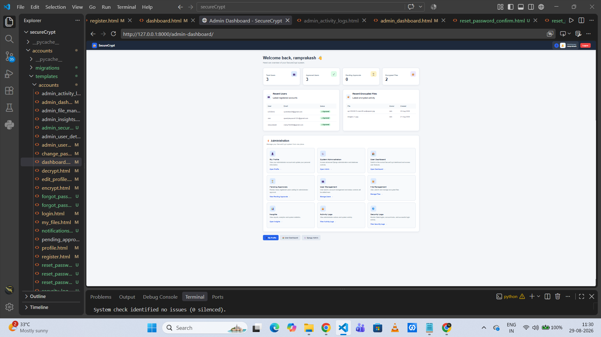
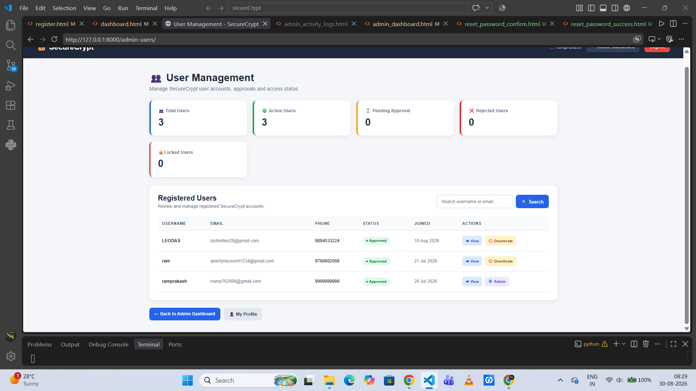
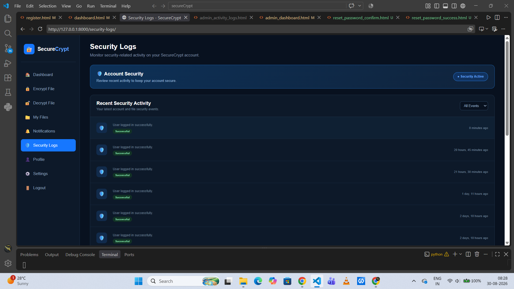
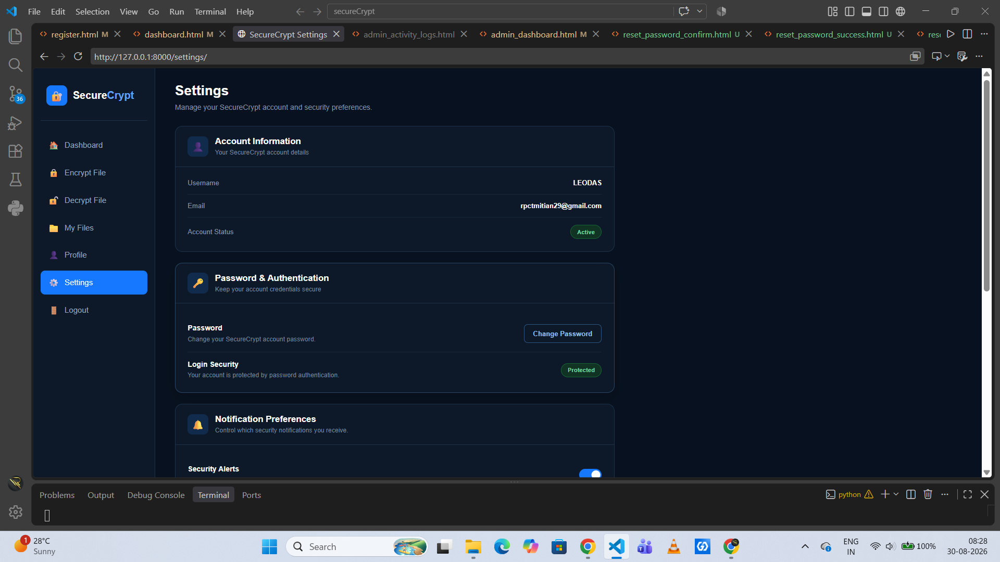
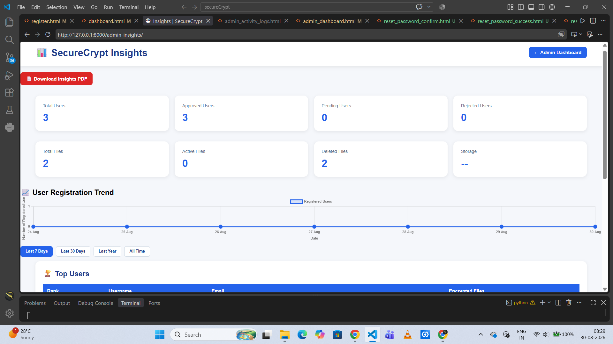
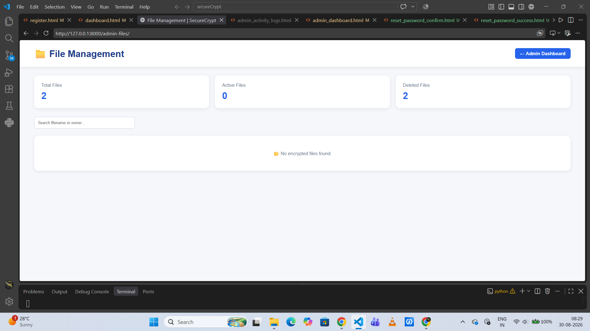

# 🔐 SecureCrypt

<div align="center">

# Secure File Protection & Management Platform

**A modern Django-based platform for secure file encryption, decryption, account protection, activity monitoring, and administrative management.**

<br>


<br>

> **SecureCrypt provides a clean and centralized environment for protecting files and monitoring security-related activity.**

</div>

---

## 📌 Overview

SecureCrypt is a secure file management platform designed to provide users with an organized environment for protecting and managing their files.

The application combines a modern dashboard experience with account management, encryption and decryption workflows, security activity monitoring, password management, notifications, and administrative controls.

The platform is divided into two major experiences:

- 👤 **User Portal** — Secure personal file operations and account management.
- 🛡️ **Administrator Portal** — User management, file monitoring, security logs, and platform insights.

---

# ✨ Key Features

<table>
<tr>
<td width="50%">

### 🔐 File Security
- Encrypt files through a dedicated workflow
- Decrypt protected files
- Centralized file management
- File activity visibility

</td>
<td width="50%">

### 👤 User Account System
- User registration
- Secure login
- Profile management
- Password management
- Account status monitoring

</td>
</tr>

<tr>
<td width="50%">

### 🛡️ Security Monitoring
- Security activity logs
- Login activity tracking
- Security event history
- Account protection status
- Event filtering interface

</td>
<td width="50%">

### 👨‍💼 Admin Management
- Registered user management
- User approval visibility
- Account status controls
- Administrative security logs
- File management dashboard

</td>
</tr>

<tr>
<td width="50%">

### 📊 Insights & Analytics
- User statistics
- Registration trends
- File statistics
- Top-user visibility
- Downloadable insights interface

</td>
<td width="50%">

### 🔔 Account Controls
- Notifications
- Settings
- Login security information
- Password & authentication controls
- Security preferences

</td>
</tr>
</table>

---

# 🖥️ Application Preview

## 🌙 User Dashboard

The main SecureCrypt dashboard provides users with an immediate overview of their account protection status, encrypted files, security events, and quick access to encryption and decryption actions.

<p align="center">
  
</p>

---

## 👥 User Management

The administrator can monitor registered users, account approval status, active users, pending accounts, rejected users, and account-level actions.

<p align="center">
  
</p>

---

## 🛡️ Security Logs

SecureCrypt provides a dedicated security log interface for reviewing recent account and security-related activity.

<p align="center">
  
</p>

### Activity monitoring includes:

- Successful login events
- Security-related account activity
- Recent event history
- Event status indicators
- Time-based activity information

---

## ⚙️ Account Settings

Users can manage their account information and security preferences from a centralized settings interface.

<p align="center">
  
</p>

---

## 📊 SecureCrypt Insights

The administration analytics section provides a high-level view of users, files, account statuses, and registration trends.

<p align="center">
  
</p>

---

## 📁 File Management

Administrators can monitor overall file statistics including total files, active files, and deleted files.

<p align="center">
  
</p>

---

# 🏗️ System Architecture

```text
                    ┌─────────────────────┐
                    │      SecureCrypt    │
                    │   Django Platform   │
                    └──────────┬──────────┘
                               │
              ┌────────────────┴────────────────┐
              │                                 │
      ┌───────▼────────┐               ┌────────▼────────┐
      │   User Portal   │               │  Admin Portal    │
      └───────┬────────┘               └────────┬────────┘
              │                                 │
     ┌────────┼─────────┐             ┌─────────┼──────────┐
     │        │         │             │         │          │
  Encrypt   Decrypt   Files        Users      Logs     Insights
     │        │         │             │         │          │
     └────────┴─────────┘             └─────────┴──────────┘
              │                                 │
              └──────────────┬──────────────────┘
                             │
                     ┌───────▼────────┐
                     │ Security Layer │
                     │ Authentication │
                     │ Activity Logs  │
                     │ Account Status │
                     └────────────────┘
```

---

# 🧩 Core Modules

| Module | Description |
|---|---|
| 🔐 Encrypt File | Interface for protecting user files |
| 🔓 Decrypt File | Interface for accessing protected files |
| 📁 My Files | Centralized user file management |
| 🔔 Notifications | Security and account notifications |
| 🛡️ Security Logs | User security activity history |
| 👤 Profile | User account information |
| ⚙️ Settings | Password and security preferences |
| 👥 User Management | Administrative account monitoring |
| 📊 Insights | Platform-level statistics and trends |
| 📁 File Management | Administrative file monitoring |
| 🔑 Password Management | Password change and reset workflows |

---

# 🎨 Interface Design

SecureCrypt follows two visual environments:

### User Interface
- Dark security-focused theme
- Blue accent system
- Sidebar navigation
- Status cards
- Quick action components
- Activity timeline design

### Administrator Interface
- Clean management dashboard
- Statistical cards
- Data tables
- Search and action controls
- Analytics visualization
- Centralized administration

---

# 🛠️ Technology Stack

| Technology | Usage |
|---|---|
| 🐍 Python | Core application language |
| 🎯 Django | Backend framework |
| 🌐 HTML5 | Page structure |
| 🎨 CSS3 | Interface styling |
| ⚡ JavaScript | Client-side interactions |
| 🗄️ Django ORM | Application data handling |
| 📊 Chart Visualization | Administrative insights |

---

# 🚀 Getting Started

## 1. Clone the Repository

```bash
git clone https://github.com/your-username/securecrypt.git
cd securecrypt
```

## 2. Create a Virtual Environment

```bash
python -m venv venv
```

### Windows

```bash
venv\Scripts\activate
```

### Linux / macOS

```bash
source venv/bin/activate
```

## 3. Install Dependencies

```bash
pip install -r requirements.txt
```

## 4. Apply Database Migrations

```bash
python manage.py makemigrations
python manage.py migrate
```

## 5. Create an Administrator Account

```bash
python manage.py createsuperuser
```

## 6. Run the Application

```bash
python manage.py runserver
```

Open:

```text
http://127.0.0.1:8000/
```

Django Administration:

```text
http://127.0.0.1:8000/admin/
```

---

# 📂 Suggested Project Structure

```text
SecureCrypt/
│
├── accounts/
│   ├── migrations/
│   ├── templates/
│   │   └── accounts/
│   ├── admin.py
│   ├── apps.py
│   ├── models.py
│   ├── tests.py
│   └── views.py
│
├── securecrypt/
│   ├── settings.py
│   ├── urls.py
│   ├── asgi.py
│   └── wsgi.py
│
├── static/
│   ├── css/
│   ├── icons/
│   ├── images/
│   └── js/
│
├── media/
├── docs/
├── screenshots/
├── manage.py
├── requirements.txt
└── README.md
```

---

# 📸 Adding the Screenshots

For the README preview to work correctly on GitHub, create this structure:

```text
screenshots/
├── dashboard.png
├── user-management.png
├── security-logs.png
├── settings.png
├── insights.png
└── file-management.png
```

Then the images in this README will automatically render on GitHub.

---

# 🔒 Security-Oriented Design

SecureCrypt is designed around the idea that file protection should not feel complicated.

The interface emphasizes:

> **Visibility → Control → Protection → Monitoring**

Users can access security-related features from one centralized workspace, while administrators gain additional visibility into platform activity, user accounts, files, and security events.

---

# 🗺️ Future Improvements

- [ ] Two-factor authentication
- [ ] Advanced file sharing controls
- [ ] Email security alerts
- [ ] Device/session management
- [ ] File access expiration controls
- [ ] Advanced security analytics
- [ ] Role-based access control
- [ ] Improved audit reporting
- [ ] Cloud storage integration
- [ ] API support

---

# 🤝 Contributing

Contributions, improvements, and feature suggestions are welcome.

1. Fork the repository
2. Create a feature branch
3. Make your changes
4. Commit your changes
5. Push to your branch
6. Open a Pull Request

---

# 📄 License

This project is intended for educational and development purposes.

---

<div align="center">

## 🔐 SecureCrypt

### Protect • Manage • Monitor

**A modern platform for secure file management and security monitoring.**

<br>

⭐ If you find this project useful, consider giving the repository a star.

</div>
